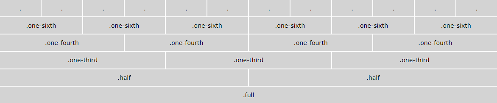
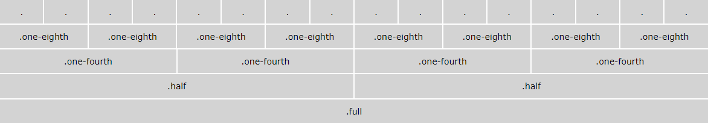
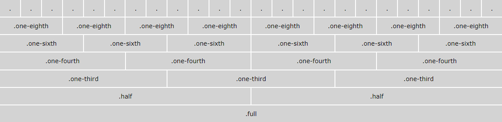
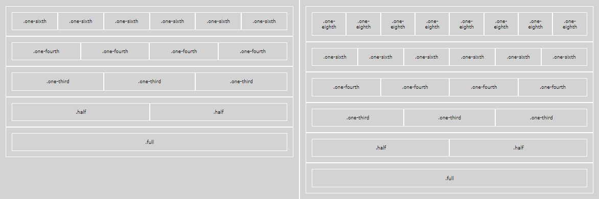

<!--
docs:
title: "Column Grids"
layout: detail
section: components
excerpt: "A CSS only responsive grid."
contributor: Arnold Haban
-->
# Column Grids


>A lightweight mobile-first responsive column-variate grid system using flexbox layout. Available columns are 12, 16, 18 and 24 columns.


## Author

* **Arnold Haban**

## Getting Started

To embed [CSS file](https://raw.githubusercontent.com/hsbyte/ah-column-grids/master/css/ah-column-grid.min.css) into a webpage, copy this code into the <head> of your HTML document. 

```html
<link href="css/ah-column-grid.min.css" rel="stylesheet" type="text/css">
```
or

```html
<style>
    @import url('https://raw.githubusercontent.com/hsbyte/ah-column-grids/master/css/ah-column-grid.min.css');
</style>
```
##### Live Sass Settings

>You may use the following settings to compile the sass files with Live Sass Compiler.
```json
{
    "liveSassCompile.settings.formats":[
        {
            "format": "compressed",
            "extensionName": ".min.css",
            "savePath": "~/../css/"
        }
    ],
    "liveSassCompile.settings.generateMap": false
}
```

#
### Usage 

>* **xs?** - for extra small screen devices, 319px and down.
>* **s?** - for small screen devices, 320px to 599px.
>* **m?** - for medium screen devices, 600 px to 992px.
>* **l?** - for large screen devices, 993px to 1199px.
>* **xl?** - for extra large screen devices, 1200px and up.
><p><i>where ? equal to 12, 16 and 24 column grid sizes.</i></p>

#
### HTML Structure

Container is 90% width of up to 1920 pixels for all grid layouts. There are no paddings and gutters for all columns, bottom margin of 20 pixels for each rows.

#
###### 12-Column Grid



```html
<div class="column-grid">
  <div class="row-wrap">
    <div class="col-12 s12 m4 l2 xl2"><!--your content here--></div>
    <div class="col-12 s12 m4 l6 xl8"><!--your content here--></div>
    <div class="col-12 s12 m4 l4 xl2"><!--your content here--></div>
  </div>
</div>
```

#
###### 16-Column Grid



```html
<div class="column-grid">
  <div class="row-wrap">
    <div class="col-16 xs16 m3 l4"><!--your content here--></div>
    <div class="col-16 xs16 m7 l4"><!--your content here--></div>
    <div class="col-16 xs16 m4 l4"><!--your content here--></div>
    <div class="col-16 xs16 m2 l4"><!--your content here--></div>
  </div>
</div>
```
#
###### 24-Column Grid



```html
<div class="column-grid">
  <div class="row-wrap">
    <div class="col-24 xs24 m1 xl6"><!--your content here--></div>
    <div class="col-24 xs24 m12 xl8"><!--your content here--></div>
    <div class="col-24 xs24 m8 xl8"><!--your content here--></div>
    <div class="col-24 xs24 m3 xl2"><!--your content here--></div>
  </div>
</div>
```
#
#### Nested grid

Nested layout grid behaves exactly like when they are not nested, and possible for mixed layouts such as combined 12-16, 12-24, 16-12-24 grid level layouts. However, it is not recommended for deeply nested grids.



###### Example: Two-Level Grids
```html
<div class="column-grid">
    <div class="row-wrap">
        <div class="col-12 xs12 l6">
            <div class="row">
                <div class="col-12 l6 xl3"><!--your content here--></div>
                <div class="col-12 l6 xl3"><!--your content here--></div>
                <div class="col-12 l6 xl3"><!--your content here--></div>
                <div class="col-12 l6 xl3"><!--your content here--></div>
            </div>
        </div>
        <div class="col-12 xs12 l6">
            <div class="row-wrap">
                <div class="col-12 l6 xl3"><!--your content here--></div>
                <div class="col-12 l6 xl3"><!--your content here--></div>
                <div class="col-12 l6 xl3"><!--your content here--></div>
                <div class="col-12 l6 xl3"><!--your content here--></div>
            </div>
        </div>
    </div>
</div>
```
#
#### Updates
>Added 18-column grid.